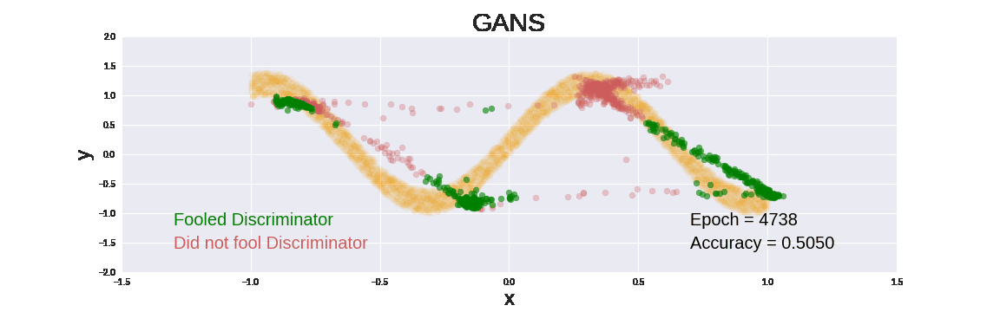

### Basic Generative Adversarial Networks 

Ben Phillips
[Personal Website](https://benjaminphillips22.github.io)

I created a Generator network that can generate points from a 2D distribution. In this case, that distribution is a sine wave with added random noise. To train the Generator, a Discriminator is also used, which is trained to discern the difference between data from the real distribution and the generatored distribution. This medium [article](https://medium.com/@devnag/generative-adversarial-networks-gans-in-50-lines-of-code-pytorch-e81b79659e3f) by Dev Nag was extremely helpful in understanding and implementing this project

View `gan.py` for the code used the create the gifs below. If it takes too long to run on your computer, you can run it on google colab.

For the just initialised Generator and Discriminator, the networks are producing results all over the place. After about 200 epochs the Generator is producing data that spans the range of the data from our distribution. The orange is the distribution that we hope the Generator will learn. The green is output from the Generator the fooled the Discriminator and the red is output from the Generator that failed to fool the Discriminator.

Sometimes the Generator gets close to fitting part of our given distribution, but the Discriminator quickly learns where the Generator is generating data and where it isn't. To over come this obstacle, the Generator may have to learn to generate data across the whole target distribution at once instead of incrementally.

Even after 4000 epochs, the fight between Generator and Discriminator continue without end in sight. You can see the Generator getting close the approximating the target distribution but the signal from the Discriminator is too noisy.

Increasing the random input to the Generator from 1 to 20 changed it's behaviour in an interesting way.

Increasing the random input from 20 to 100, and the number of nodes on the hidden layers from 100 to 200 (only for the Generator) gives the best model yet. Though it still suffers the problems of the smaller models, that when it learns to approximate only part of the target distribution well, the Discriminator forces the Generator to 'unlearn' that specific part. This gif runs a bit slower than the previous gifs, with several frames shown at each Discriminator step, showing the Discriminator incrementally learning to distinguish between real and generated data.

 